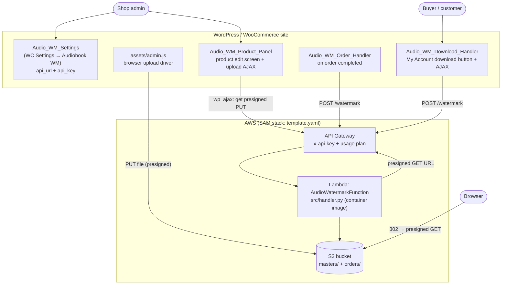

# Architecture

Forensic audio-watermarking pipeline for a WooCommerce audiobook shop. This
document describes **what the code actually does today** — every claim below is
traceable to a file/line in the repo. Where the implementation has a gap or a
known limitation it is called out explicitly rather than glossed over.

> Source of truth: `src/handler.py`, `src/watermark.py`, `src/storage.py`,
> `template.yaml`, and `wordpress/audio-watermark-woo/`. If this doc and the
> code disagree, the code wins — please fix the doc.

---

## 1. Components



| Component | File | Responsibility |
|-----------|------|----------------|
| Watermark core | `src/watermark.py` | DCT spread-spectrum embed/detect, MP3 transcode. **No AWS imports.** |
| S3 helpers | `src/storage.py` | download, upload, `object_exists`, presigned PUT/GET. **Only file with boto3.** |
| Lambda router | `src/handler.py` | Routes `/products/upload-url` and `/watermark`; input validation; idempotency. |
| Local CLI | `cli.py` | `embed` / `detect` / `roundtrip-test` without AWS (used for forensic detection). |
| Infra | `template.yaml` | S3 bucket, Lambda, API Gateway, API key, usage plan. |
| WC settings | `wordpress/.../class-settings.php` | Stores `audio_wm_api_url`, `audio_wm_api_key`. |
| WC product panel | `wordpress/.../class-product-panel.php` | Enable checkbox, S3 key field, upload button + AJAX proxy. |
| WC order handler | `wordpress/.../class-order-handler.php` | On `woocommerce_order_status_completed`, watermark each enabled item. |
| WC download handler | `wordpress/.../class-download-handler.php` | Per-item download buttons + ownership-checked AJAX redirect. |
| Upload JS | `wordpress/.../assets/admin.js` | Drives browser → presigned-PUT upload. |

---

## 2. HTTP API (both endpoints behind `x-api-key`)

Defined in `src/handler.py`; auth + throttling in `template.yaml`.

### `POST /products/upload-url`
Mint a presigned S3 PUT so a browser can upload a master directly (no file data
through WordPress, no AWS keys in WordPress).

Request:
```json
{ "product_id": "123", "filename": "audiobook.wav", "content_type": "audio/wav" }
```
Response:
```json
{ "upload_url": "https://s3...presigned-put", "s3_key": "masters/123/audiobook.wav" }
```

Validation (`route_upload_url`):
- `product_id` must match `^[A-Za-z0-9_\-]+$`.
- `filename` required; sanitized to `[A-Za-z0-9._-]` via `_safe_filename`.
- `content_type` must be in the audio allowlist (`_AUDIO_CONTENT_TYPES`), else `400`.
- Presigned PUT expiry: **900 s (15 min)**.

### `POST /watermark` (idempotent)
Request:
```json
{ "master_key": "masters/123/audiobook.wav", "order_id": 456789, "item_id": 7 }
```
Response:
```json
{ "download_url": "https://s3...presigned-get", "watermark_code": 456789, "from_cache": false }
```

Validation (`route_watermark`):
- `master_key` required, **must start with `masters/`**, must not contain `..` segments.
- `order_id` must be an integer `1 … 2^32-1` (also the embedded 32-bit code).
- `item_id` **optional**; if present must be a positive integer (WooCommerce
  order-item ID). It only namespaces the stored copy — it is **not** part of the
  embedded code.
- Presigned GET expiry: **3600 s (1 h)**, signed with the Lambda execution role.

Output key:
- With `item_id` → `orders/<order_id>/<item_id>.mp3` (so two different titles in
  one order never collide).
- Without `item_id` → `orders/<order_id>.mp3` (single-item / web-console path).

Behaviour:
- **Fast path** — if the target copy already exists (`object_exists`), return a
  fresh presigned GET with `from_cache: true`. No re-embedding.
- **Slow path** — download master → `embed_watermark(order_id)` →
  `transcode_to_mp3` (128 kbps) → upload to the output key → presign,
  `from_cache: false`.

> The embedded watermark code is always `order_id`, independent of `item_id`, so
> forensic tracing remains per-order (the buyer). Per-item keying only fixes
> *delivery* so each title is served correctly.

---

## 3. Data model

### S3 layout (`template.yaml`)
| Prefix | Content | Lifecycle |
|--------|---------|-----------|
| `masters/<product_id>/<filename>` | Product master | Permanent (no rule) |
| `orders/<order_id>/<item_id>.mp3` | Buyer copy, per line item (sent by the plugin) | 30-day expiry; non-current versions purged after 1 day |
| `orders/<order_id>.mp3` | Buyer copy when no `item_id` is sent (single-item / web console) | 30-day expiry |

Bucket hardening: all public access blocked, SSE-AES256 default encryption,
versioning enabled.

### WordPress metadata
| Storage | Key | Set by | Meaning |
|---------|-----|--------|---------|
| `wp_options` | `audio_wm_api_url` | Settings page | API base URL |
| `wp_options` | `audio_wm_api_key` | Settings page | `x-api-key` secret |
| Product (post) meta | `_audio_wm_enabled` | Product panel | `'yes'`/`'no'` |
| Product (post) meta | `_audio_wm_s3_key` | Product panel (after upload) | Master S3 key |
| **Order item** meta | `_audio_wm_master_key` | Order handler | Master key for that line item (HPOS-safe `$item->update_meta_data` + `save`) |
| Order meta | `_watermark_code` | Order handler | `= order_id`; flags "≥1 item watermarked" |

> Per-item meta (not order meta) is used deliberately so a multi-product order
> tracks each title's master independently — see `class-order-handler.php`.

---

## 4. WordPress hooks used

| Hook | Handler | Purpose |
|------|---------|---------|
| `before_woocommerce_init` | bootstrap closure | Declare HPOS (`custom_order_tables`) compatibility |
| `plugins_loaded` | bootstrap closure | Require classes once WooCommerce is confirmed active |
| `woocommerce_settings_tabs_array` / `_settings_audio_wm` / `_settings_save_audio_wm` | `Audio_WM_Settings` | Settings tab render + save |
| `woocommerce_product_options_general_product_data` | `Product_Panel::add_fields` | Product fields |
| `woocommerce_process_product_meta` | `Product_Panel::save_fields` | Persist product fields |
| `admin_enqueue_scripts` | `Product_Panel::enqueue_scripts` | Load `admin.js` on product screens only |
| `wp_ajax_audio_wm_get_upload_url` | `Product_Panel::ajax_get_upload_url` | Proxy presigned-PUT request (key stays server-side) |
| `woocommerce_order_status_completed` | `Order_Handler::process_order` | Watermark all enabled items |
| `woocommerce_order_details_after_order_table` | `Download_Handler::add_download_buttons` | Render per-item download buttons |
| `wp_ajax_audio_wm_download` | `Download_Handler::handle_download` | Ownership-checked redirect to fresh presigned GET |

> `woocommerce_order_details_after_order_table` renders on the order-details page
> only. Because `add_download_buttons` returns early when `get_current_user_id()`
> doesn't own the order, nothing leaks into WooCommerce HTML emails (no user is
> logged in when WC renders an email).

---

## 5. Security model

- **Transport auth:** API Gateway enforces `x-api-key` on both routes before the
  Lambda runs; bad requests cost nothing.
- **Throttling:** usage plan — burst 10, rate 5/s, quota 10 000/day — caps a
  leaked key.
- **Path confinement:** `/watermark` rejects any `master_key` not under
  `masters/`, so a caller cannot read `orders/` copies or arbitrary keys.
- **Upload AJAX:** nonce (`audio_wm_upload_nonce`) + `current_user_can('edit_products')`.
- **Download AJAX:** per-order nonce + buyer-ownership check + item-belongs-to-order
  check (`$order->get_item($item_id)`) + open-redirect guard (URL host must end
  with `.amazonaws.com` and scheme `https`).
- **Least-privilege IAM:** Lambda gets only `s3:GetObject`/`PutObject` on
  `masters/*` + `orders/*` and `s3:HeadObject` on `orders/*` — no delete, no list.
- **No long-lived AWS keys in WordPress:** browser PUTs via presigned URL; the
  WP server only ever holds the API key.
- **No SES:** all customer email is handled by WordPress.

---

## 6. Memory-bounded embedding

`embed_watermark` only decodes the first `_REQUIRED = BLOCK_SIZE × NUM_BLOCKS`
samples (~12 s at 44.1 kHz) into numpy via `_load_head` (soundfile partial read
for WAV/FLAC, ffmpeg pipe for MP3). For longer files the untouched tail is
stitched back with an ffmpeg `concat` filter (`_stitch_with_tail`), so a
multi-hour master never loads more than a few MB into Python. Detection
(`detect_watermark`) likewise reads only the opening ~12 s.

**Consequence (documented honestly):** the mark lives only in the first ~12 s,
so trimming the opening removes it. See `docs/USE-CASES.md` → Known limitations.

---

## 7. Observability

### CloudWatch metrics (Embedded Metrics Format)
`handler.py` writes [EMF](https://docs.aws.amazon.com/AmazonCloudWatch/latest/monitoring/CloudWatch_Embedded_Metric_Format.html)
JSON to stdout on every `/watermark` call. CloudWatch ingests it as real metrics
with no extra cost (no `PutMetricData` calls):

| Metric | Unit | When emitted |
|--------|------|--------------|
| `CacheHit` | Count | Fast path — buyer copy already in S3 |
| `CacheMiss` | Count | Slow path — new embed + transcode |
| `EmbedDuration` | Milliseconds | Slow path only (embedding time) |

Namespace: `AudioWM`. Dimension: `Service = audio-watermark`.
All `logger.info` entries are structured JSON, so CloudWatch Logs Insights can
query on `event`, `order_id`, `embed_ms`, etc.

### X-Ray tracing
`Tracing: Active` in `template.yaml`. SAM attaches the X-Ray daemon automatically.
Traces API Gateway → Lambda → S3 calls. Free tier: 100k traces/month.

### WooCommerce order notes
`class-order-handler.php` adds a note to every order on each watermark attempt
(success, retry, and final failure). Staff see watermark status directly in
WC Admin → Orders without needing AWS console access.

### `detect_watermark` confidence score
`watermark.py::detect_watermark()` returns `(code: int, confidence: float)`.
Confidence = `min(|votes|) / max(|votes|)` — a 0-1 score computed from the
per-bit DCT correlation margins at zero extra cost. Values > ~0.1 are reliably
correct; the CLI prints it alongside the code.
