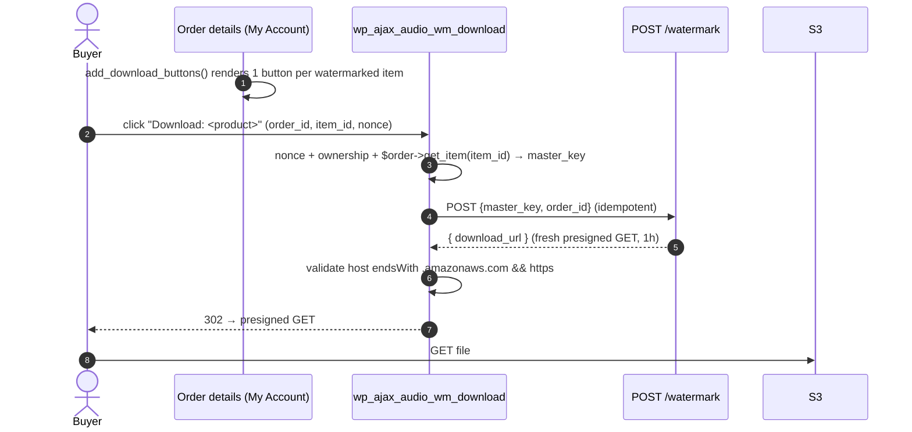

# Use Cases & Flow Specs

Every supported flow, written as a spec: **actors, preconditions, the exact
sequence the code performs, postconditions, and error handling.** Diagrams use
real function / meta-key / endpoint names so they can be checked against the
source.

Then a **Known limitations & unhandled cases** section lists, honestly, what the
code does *not* currently handle — including one correctness bug for multi-item
orders that should be decided on before production.

Actors:
- **Admin** — shop manager editing products (`edit_products` capability).
- **Buyer** — logged-in customer who placed an order.
- **Service** — API Gateway + Lambda (`src/handler.py`).
- **Forensic analyst** — whoever runs `cli.py detect` on a leaked file.

---

## UC-1 — Configure the service

**Actor:** Admin · **Pre:** SAM stack deployed; admin has API base URL + key.

1. WooCommerce → Settings → **Audiobook WM** (`Audio_WM_Settings`).
2. Enter **base URL** (`audio_wm_api_url`) and **API key** (`audio_wm_api_key`).
3. Save → stored in `wp_options`.

**Post:** every later service call sends `x-api-key: <audio_wm_api_key>` to
`audio_wm_api_url`. **Errors:** if URL is empty, upload/watermark calls fail
fast with a clear message (`class-product-panel.php`, `class-order-handler.php`).

---

## UC-2 — Admin uploads a master to the product library

**Actor:** Admin · **Pre:** UC-1 done; editing a product.

```mermaid
sequenceDiagram
    autonumber
    actor Admin
    participant Panel as Product edit page
    participant JS as admin.js
    participant WP as wp_ajax_audio_wm_get_upload_url
    participant API as POST /products/upload-url
    participant S3

    Admin->>Panel: check "Enable watermarking", click "Upload master audio"
    Panel->>JS: file chosen
    JS->>WP: POST {product_id, filename, content_type} (+nonce)
    WP->>WP: check nonce + current_user_can('edit_products')
    WP->>API: POST {product_id, filename, content_type} (x-api-key)
    API->>API: validate; build masters/<product_id>/<safe_filename>
    API-->>WP: { upload_url (presigned PUT, 15m), s3_key }
    WP-->>JS: { upload_url, s3_key }
    JS->>S3: PUT file (direct, presigned)
    S3-->>JS: 200
    JS->>Panel: fill _audio_wm_s3_key, prompt "Save product"
    Admin->>Panel: Save product
    Panel->>WP: woocommerce_process_product_meta → save _audio_wm_enabled, _audio_wm_s3_key
```

**Post:** product has `_audio_wm_enabled=yes` and `_audio_wm_s3_key=masters/<id>/<file>`;
the file is in S3 under `masters/`. **Errors:** nonce/permission → 403 JSON;
service/S3 errors surface in the status line via `admin.js` (step 6 catch).

> **Note:** the S3 key is only persisted when the admin clicks **Save product**
> after the upload. Uploading and then leaving without saving stores the file in
> S3 but loses the key reference (orphan master in `masters/`).

---

## UC-3 — Order completed → watermark each eligible item

**Actor:** Service (triggered by WooCommerce) · **Pre:** order reaches
**completed**; ≥1 item's product has `_audio_wm_enabled=yes` + `_audio_wm_s3_key`.

```mermaid
sequenceDiagram
    autonumber
    participant WC as woocommerce_order_status_completed
    participant OH as Order_Handler::process_order
    participant API as POST /watermark
    participant WM as embed_watermark + transcode_to_mp3
    participant S3

    WC->>OH: order_id
    loop each line item
        OH->>OH: product enabled? has master key?
        OH->>API: POST {master_key, order_id} (x-api-key)
        alt orders/<order_id>.mp3 exists
            API-->>OH: { download_url, from_cache:true }
        else
            API->>S3: download master
            API->>WM: embed order_id → MP3 128k
            API->>S3: put orders/<order_id>.mp3
            API-->>OH: { download_url, watermark_code, from_cache:false }
        end
        OH->>OH: $item->update_meta_data('_audio_wm_master_key', master_key); $item->save()
    end
    OH->>OH: if any watermarked → order._watermark_code = order_id
```

**Post:** `orders/<order_id>.mp3` exists; each watermarked item has
`_audio_wm_master_key`; order has `_watermark_code`. **Errors:** a failed
service call is logged (`error_log`) and **does not block order completion**;
that item simply gets no item meta and no download button (see Gap G2).

> ⚠️ **Multi-item orders are not handled correctly here — see Gap G1.**

---

## UC-4 — Buyer downloads the audiobook

**Actor:** Buyer · **Pre:** UC-3 set `_watermark_code` on the order; buyer is
logged in and owns the order.



**Post:** buyer receives the watermarked MP3 via a 1-hour presigned URL minted
fresh on each click. **Errors:** failed nonce/ownership/item-check → `wp_die`
with 403/404/400; bad/missing/`non-amazonaws` URL → 502/503 `wp_die`.

---

## UC-5 — Re-download after the 30-day copy expired

**Actor:** Buyer · **Pre:** `orders/<order_id>.mp3` deleted by lifecycle rule.

Identical to UC-4: `handle_download` calls `/watermark`; the object is gone, so
the service takes the **slow path** and regenerates it deterministically from
the master (same `order_id` → same watermark). The buyer notices nothing beyond
a slightly slower first click.

**Post:** copy re-created; fresh URL returned. **Pre-req for this to work:** the
master still exists under `masters/` and the stored `_audio_wm_master_key` still
points to it (see Gap G3).

---

## UC-6 — Forensic trace of a leaked file

**Actor:** Forensic analyst · **Pre:** a leaked audio file is in hand.


Detection runs **offline** (`cli.py` / `detect_watermark`) — there is no
buyer-facing detect endpoint by design. The recovered code is the WooCommerce
order ID; look it up to identify the buyer.

**Post:** buyer identified. **Limitation:** the code identifies the *order*
(hence buyer), not which title within a multi-item order — see Gap G4.

---

## Known limitations & unhandled cases

These are real, verified against the code — listed so we can decide what to
implement before production.

### G1 — 🔴 Multi-item orders serve the wrong file (correctness bug)
`route_watermark` keys the output at **`orders/<order_id>.mp3`** — on `order_id`
alone (`src/handler.py:116`). But `process_order` loops **every** eligible item
calling `/watermark` with the same `order_id` and a different `master_key`
(`class-order-handler.php:43-67`). The first item creates `orders/<order_id>.mp3`;
every later item hits the idempotency fast path (`object_exists`) and is served
**the first product's audio**. At download time UC-4 has the same collision:
clicking "Download: Product B" returns Product A's file.

*Impact:* any order containing **two or more** watermark-enabled products
delivers the wrong audio for all but the first. Single-item orders are fine.

*Fix options (needs a decision):*
- **(a)** Key per item: `orders/<order_id>/<item_id>.mp3` (or `<product_id>`),
  and pass that scope through `/watermark`. Cleanest; buyers get correct files.
- **(b)** Embed a per-item code instead of the bare `order_id` and key on it —
  also improves forensic granularity (G4) but changes the 32-bit code scheme.

### G2 — Failed watermarking at completion is silent to staff
If the service call in UC-3 fails, it is only `error_log`-ged; the order
completes, no `_audio_wm_master_key` is stored, and the buyer simply sees no
download button. There is no admin notice, retry, or order note. Consider a
WooCommerce order note and/or an admin-visible retry.

### G3 — Master change / deletion after orders exist
- Changing a product's `_audio_wm_s3_key` does **not** regenerate already-cached
  `orders/<order_id>.mp3` copies until the 30-day expiry; existing orders keep
  serving the old master (their `_audio_wm_master_key` was captured at order time).
- If a master under `masters/` is deleted, UC-5 regeneration fails with `404`
  after the buyer copy expires. Masters have no lifecycle rule, so this only
  happens on manual deletion — but nothing guards against it.

### G4 — Forensic granularity is per-order, not per-title
The embedded code is the order ID, so two leaked files from the same multi-item
order both decode to the same number. You learn the buyer, not which purchased
title leaked (though the audio content itself usually makes that obvious).
Fixing G1 via option (b) would also resolve this.

### G5 — Watermark only in the first ~12 s (trim-vulnerable)
By design (memory-bounded embed), the mark lives in the opening ~12 s. Trimming
the start removes it. Tiling the mark across the whole book is a stronger but
heavier follow-up; out of scope today.

### G6 — Only `woocommerce_order_status_completed` triggers watermarking
Shops that deliver downloads on **processing** (e.g. before manual completion)
get no watermark/button until the order is marked completed. If that workflow is
desired, also hook `woocommerce_order_status_processing` (or make it configurable).

### G7 — Stale top-level docs (not the code)
`README.md` and `docs/DEPLOYMENT.md` still describe the pre-Phase-5 design: SES
email delivery, `src/notify.py`, `scripts/verify-recipient.sh`, a 48-hour link,
and 2-day expiry — **all removed** in Phase 5 (no SES; `notify.py` and
`verify-recipient.sh` no longer exist; expiry is 30 days; delivery is via
WordPress download button). `CLAUDE.md`, `template.yaml`, the scripts, and the
plugin are current; these two guides need rewriting.

---

## Coverage summary

| Use case | Status |
|----------|--------|
| Configure service (UC-1) | ✅ implemented |
| Upload master (UC-2) | ✅ implemented (minor orphan-on-no-save note) |
| Watermark on completion — single-item order (UC-3) | ✅ implemented |
| Watermark on completion — multi-item order | 🔴 **G1 bug** |
| Buyer download (UC-4) | ✅ implemented (single-item) |
| Re-download after expiry (UC-5) | ✅ implemented |
| Forensic trace (UC-6) | ✅ implemented (per-order granularity, G4) |
| Failure visibility to staff (G2) | ❌ not implemented |
| Master change/delete safety (G3) | ⚠️ partial |
| Trim resistance (G5) | ❌ by design |
| Non-completed delivery workflows (G6) | ❌ not implemented |
