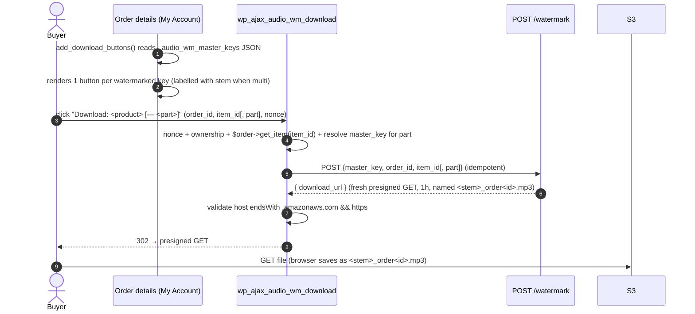

# Use Cases & Flow Specs

Every supported flow, written as a spec: **actors, preconditions, the exact
sequence the code performs, postconditions, and error handling.** Diagrams use
real function / meta-key / endpoint names so they can be checked against the
source.

Then a **Known limitations & unhandled cases** section lists, honestly, what the
code does *not* currently handle — including one correctness bug for multi-item
orders that should be decided on before production.

Actors:
- **Admin** — shop manager editing products (`edit_products` capability).
- **Buyer** — logged-in customer who placed an order.
- **Service** — API Gateway + Lambda (`src/handler.py`).
- **Forensic analyst** — whoever runs `cli.py detect` on a leaked file.

---

## UC-1 — Configure the service

**Actor:** Admin · **Pre:** SAM stack deployed; admin has API base URL + key.

1. WooCommerce → Settings → **Audiobook WM** (`Audio_WM_Settings`).
2. Enter **base URL** (`audio_wm_api_url`) and **API key** (`audio_wm_api_key`).
3. Save → stored in `wp_options`.

**Post:** every later service call sends `x-api-key: <audio_wm_api_key>` to
`audio_wm_api_url`. **Errors:** if URL is empty, upload/watermark calls fail
fast with a clear message (`class-product-panel.php`, `class-order-handler.php`).

---

## UC-2 — Admin uploads master files to the product library

**Actor:** Admin · **Pre:** UC-1 done; editing a product.

One product can have **one or more master files** (chapters, CDs, parts). Each
file is uploaded individually; the browser PUTs each one directly to S3. The
product panel maintains a list — the admin clicks "Add master audio file" once per
file and the list grows, each entry showing the filename with a "Remove" button.

```mermaid
sequenceDiagram
    autonumber
    actor Admin
    participant Panel as Product edit page
    participant JS as admin.js
    participant WP as wp_ajax_audio_wm_get_upload_url
    participant API as POST /products/upload-url
    participant S3

    Admin->>Panel: check "Enable watermarking", click "Add master audio file"
    Panel->>JS: file chosen (repeat for each part)
    JS->>WP: POST {product_id, filename, content_type} (+nonce)
    WP->>WP: check nonce + current_user_can('edit_products')
    WP->>API: POST {product_id, filename, content_type} (x-api-key)
    API->>API: validate; build masters/<product_id>/<safe_filename>
    API-->>WP: { upload_url (presigned PUT, 15m), s3_key }
    WP-->>JS: { upload_url, s3_key }
    JS->>S3: PUT file (direct, presigned)
    S3-->>JS: 200
    JS->>Panel: append s3_key to list + hidden JSON _audio_wm_s3_keys
    Admin->>Panel: Save product
    Panel->>WP: woocommerce_process_product_meta → save _audio_wm_enabled, _audio_wm_s3_keys (JSON array)
```

**Post:** product has `_audio_wm_enabled=yes` and `_audio_wm_s3_keys` holding a
JSON array of master S3 keys (e.g. `["masters/42/part-1.wav","masters/42/part-2.wav"]`);
all files are in S3 under `masters/<product_id>/`. **Errors:** nonce/permission
→ 403 JSON; service/S3 errors surface in the status line via `admin.js` (catch).

> **Note:** S3 keys are only persisted when the admin clicks **Save product** after
> uploading. Uploading and then leaving without saving stores the file in S3 but
> loses the key reference (orphan master in `masters/`).

> **Mixed catalog:** non-audio products (PDFs, physical goods) simply never have
> `_audio_wm_enabled=yes`, so the order and download handlers ignore them
> automatically. No per-product configuration is needed beyond leaving the checkbox
> unchecked (the default).

---

## UC-3 — Order completed → watermark each eligible item

**Actor:** Service (triggered by WooCommerce) · **Pre:** order reaches
**completed**; ≥1 item's product has `_audio_wm_enabled=yes` + `_audio_wm_s3_keys`.

```mermaid
sequenceDiagram
    autonumber
    participant WC as woocommerce_order_status_completed
    participant OH as Order_Handler::process_order
    participant API as POST /watermark
    participant WM as embed_watermark + transcode_to_mp3
    participant S3

    WC->>OH: order_id
    loop each line item (item_id)
        OH->>OH: product enabled? get master keys list
        loop each master_key in product keys
            OH->>OH: already in _audio_wm_master_keys? → skip (idempotent)
            Note over OH: part = stem(master_key) when multi-file, else ''
            OH->>API: POST {master_key, order_id, item_id[, part]} (x-api-key)
            alt output key exists in S3
                API-->>OH: { download_url, from_cache:true }
            else
                API->>S3: download master
                API->>WM: embed order_id → MP3 128k
                API->>S3: put orders/<order_id>/<item_id>[/<part>].mp3
                API-->>OH: { download_url, watermark_code, from_cache:false }
            end
            OH->>OH: append master_key to _audio_wm_master_keys JSON; $item->save()
        end
    end
    OH->>OH: if any watermarked → order._watermark_code = order_id
```

**Post:** one S3 copy per watermarked master-per-item. Single-file product:
`orders/<order_id>/<item_id>.mp3`. Multi-file product: one copy per part at
`orders/<order_id>/<item_id>/<part>.mp3`. Each item's `_audio_wm_master_keys`
accumulates successfully watermarked keys. Order has `_watermark_code`.

Non-audio items (PDF books, physical goods) are skipped because their products
lack `_audio_wm_enabled=yes` — no configuration needed.

**Errors:** a failed service call is logged, an order note is added, and the key
is **not** appended to `_audio_wm_master_keys`. Action Scheduler retries that
specific key up to 3 times (+5 min / +30 min / +2 h) without re-watermarking
already-done parts. Does not block order completion.

---

## UC-4 — Buyer downloads the audiobook

**Actor:** Buyer · **Pre:** UC-3 set `_watermark_code` on the order; buyer is
logged in and owns the order.

Single-file product: one "Download: &lt;product&gt;" button per watermarked item.
Multi-file product: one "Download: &lt;product&gt; — &lt;stem&gt;" button per watermarked
master file (chapter/part).



**Post:** buyer receives the watermarked MP3 via a 1-hour presigned URL minted
fresh on each click. Browser saves it as `<stem>_order<order_id>.mp3` (meaningful
filename via `Content-Disposition`). **Errors:** failed nonce/ownership/item-check
→ `wp_die` with 403/404/400; bad/missing/`non-amazonaws` URL → 502/503 `wp_die`;
invalid `part` → 400/404.

---

## UC-5 — Re-download after the 30-day copy expired

**Actor:** Buyer · **Pre:** `orders/<order_id>/<item_id>.mp3` (or the per-part
variant) deleted by lifecycle rule.

Identical to UC-4: `handle_download` calls `/watermark`; the object is gone, so
the service takes the **slow path** and regenerates it deterministically from
the master (same `order_id` + `part` → same watermark and output key). The buyer
notices nothing beyond a slightly slower first click.

**Post:** copy re-created; fresh URL returned. **Pre-req for this to work:** the
master still exists under `masters/` and the stored `_audio_wm_master_keys` still
lists it (see Gap G3).

---

## UC-6 — Forensic trace of a leaked file

**Actor:** Forensic analyst · **Pre:** a leaked audio file is in hand.


Detection runs **offline** (`cli.py` / `detect_watermark`) — there is no
buyer-facing detect endpoint by design. The recovered code is the WooCommerce
order ID; look it up to identify the buyer.

**Post:** buyer identified. **Limitation:** the code identifies the *order*
(hence buyer), not which title within a multi-item order — see Gap G4.

---

## Known limitations & unhandled cases

These are real, verified against the code — listed so we can decide what to
implement before production.

### G1 — ✅ RESOLVED — Multi-item orders served the wrong file
*Was:* `route_watermark` keyed the output at `orders/<order_id>.mp3` on
`order_id` alone, while `process_order` looped every eligible item with the same
`order_id`. The first item created the file; later items hit the idempotency
fast path and were served the first product's audio (both at order time and at
download).

*Fix (option a):* `/watermark` now accepts an optional `item_id` and keys the
copy at **`orders/<order_id>/<item_id>.mp3`** (`src/handler.py`). The order
handler and download handler both send the line item's `item_id`
(`class-order-handler.php`, `class-download-handler.php`), so each title gets its
own copy and downloads resolve correctly. The embedded code stays `order_id`, so
forensic tracing is unchanged (G4 still applies). Omitting `item_id` falls back to
the order-level key for single-item / web-console use. Verified: two items in one
order produce distinct keys; `item_id` ≤ 0 is rejected with `400`.

### G2 — ✅ RESOLVED — Failed watermarking now retried automatically with order notes

*Was:* a failed service call in UC-3 was only `error_log`-ged; the buyer saw no
download button and staff had no visibility.

*Fix:* `class-order-handler.php` now adds a **WooCommerce order note** on every
watermarking attempt (success or failure), visible to staff in WC Admin → Orders.
On failure it uses **Action Scheduler** (ships with WooCommerce ≥ 3.5) to
schedule automatic retries per-key:

| Attempt | Delay |
|---------|-------|
| Retry 1 | +5 min |
| Retry 2 | +30 min |
| Retry 3 | +2 h |

Each retry attempt adds its own order note (success / failure / "manual action
required" after all attempts exhausted). Individual master keys already present
in `_audio_wm_master_keys` are skipped, so retries only re-process failed parts
without duplicating already-watermarked ones.

### G3 — Master change / deletion after orders exist
- Changing a product's `_audio_wm_s3_keys` list does **not** affect already-placed
  orders; each order item's `_audio_wm_master_keys` was captured at order time, so
  existing buyers keep downloading from the master(s) that were live when they ordered.
- If a master under `masters/` is deleted, UC-5 regeneration fails with `404`
  after the buyer copy expires. Masters have no lifecycle rule, so this only
  happens on manual deletion — but nothing guards against it.
- Removing a master from a product's list and saving does not immediately affect
  any outstanding download buttons (the download handler resolves from the order
  item's `_audio_wm_master_keys`, not the current product list).

### G4 — Forensic granularity is per-order, not per-title
The embedded code is the order ID, so two leaked files from the same multi-item
order both decode to the same number. You learn the buyer, not which purchased
title leaked (though the audio content itself usually makes that obvious). The
G1 fix deliberately kept the code = order_id (it only namespaces *storage* by
item); embedding a per-item code instead would also resolve this but changes the
32-bit code scheme and forensic lookup, so it was left out of scope.

### G5 — Watermark only in the first ~12 s (trim-vulnerable)
By design (memory-bounded embed), the mark lives in the opening ~12 s. Trimming
the start removes it. Tiling the mark across the whole book is a stronger but
heavier follow-up; out of scope today.

### G6 — Only `woocommerce_order_status_completed` triggers watermarking
Shops that deliver downloads on **processing** (e.g. before manual completion)
get no watermark/button until the order is marked completed. If that workflow is
desired, also hook `woocommerce_order_status_processing` (or make it configurable).

### G7 — Stale top-level docs (not the code)
`README.md` and `docs/DEPLOYMENT.md` still describe the pre-Phase-5 design: SES
email delivery, `src/notify.py`, `scripts/verify-recipient.sh`, a 48-hour link,
and 2-day expiry — **all removed** in Phase 5 (no SES; `notify.py` and
`verify-recipient.sh` no longer exist; expiry is 30 days; delivery is via
WordPress download button). `CLAUDE.md`, `template.yaml`, the scripts, and the
plugin are current; these two guides need rewriting.

---

## Coverage summary

| Use case | Status |
|----------|--------|
| Configure service (UC-1) | ✅ implemented |
| Upload single master (UC-2) | ✅ implemented |
| Upload multiple masters (chapters/parts) per product | ✅ implemented |
| Mixed catalog — non-audio products ignored | ✅ automatic (no `_audio_wm_enabled`) |
| Watermark on completion — single-file product | ✅ implemented |
| Watermark on completion — multi-file product (N parts) | ✅ implemented (per-part keys) |
| Watermark on completion — multi-title order | ✅ fixed (per-item key, was G1) |
| Buyer download — single-file (UC-4) | ✅ implemented |
| Buyer download — multi-file (N buttons per item) | ✅ implemented |
| Re-download after expiry (UC-5) | ✅ implemented |
| Forensic trace (UC-6) | ✅ implemented (per-order granularity, G4) |
| Failure visibility to staff + per-key retry (G2) | ✅ order notes + Action Scheduler retry |
| Master change/delete safety (G3) | ⚠️ partial |
| Trim resistance (G5) | ❌ by design |
| Non-completed delivery workflows (G6) | ❌ not implemented |
